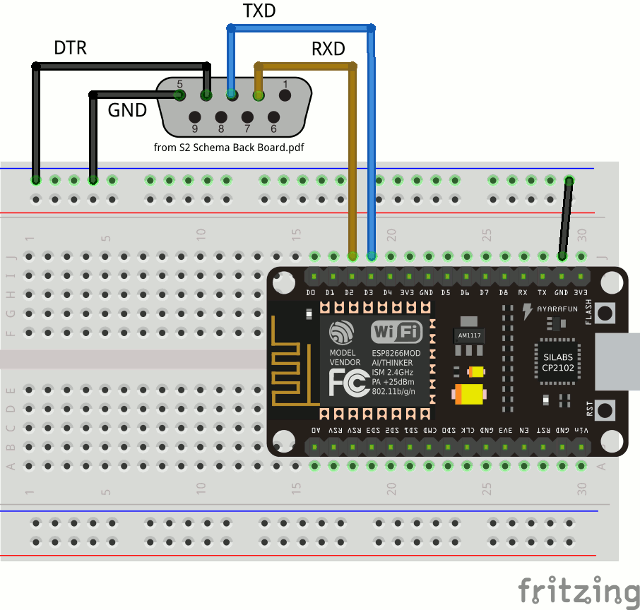

# Scribbler2-ESP8266-WiFi
Trying to add Wifi and GPIO to the Scribbler2 robot using and ESP8266 (NodeMCU)

* RS232 connections from [S2 Hardware Schematic](https://www.parallax.com/downloads/s2-hardware-schematic) (Back PCB)
* Tested with [Calico](https://bitbucket.org/ipre/calico) and [Scribbler2-Python](https://github.com/titos-carrasco/Scribbler2-Python)
* NodeMCU programming using **Arduino IDE**
* Simple code using **SoftwareSerial**
* SoftwareSerial need to be modified. It doesn't use inverse logic in **write()**


## Connections




## Arduino IDE simple code for NodeMCU

```C++
#include <SoftwareSerial.h>

SoftwareSerial swSer(D2, D3, true, 256);

void setup() {
  Serial.begin(38400);
  swSer.begin(38400);
}

void loop() {
  while( Serial.available() )
    swSer.write( Serial.read() );

  while (swSer.available() > 0)
    Serial.write(swSer.read());
}
```

### Modified SoftwareSerial.cpp

```C++
size_t SoftwareSerial::write(uint8_t b) {
   if (!m_txValid) return 0;

   if (m_invert) b = ~b;
   // Disable interrupts in order to get a clean transmit
   cli();
   if (m_txEnableValid) digitalWrite(m_txEnablePin, HIGH);
   unsigned long wait = m_bitTime;
   digitalWrite(m_txPin,!m_invert ? HIGH : LOW);
   unsigned long start = ESP.getCycleCount();
    // Start bit;
   digitalWrite(m_txPin, !m_invert ? LOW : HIGH );
   WAIT;
   for (int i = 0; i < 8; i++) {
     digitalWrite(m_txPin, (b & 1) ? HIGH : LOW);
     WAIT;
     b >>= 1;
   }
   // Stop bit
   digitalWrite(m_txPin, !m_invert ? HIGH : LOW);
   WAIT;
   digitalWrite(m_txPin, !m_invert);
   if (m_txEnableValid) digitalWrite(m_txEnablePin, LOW);
   sei();
   return 1;
}
```


